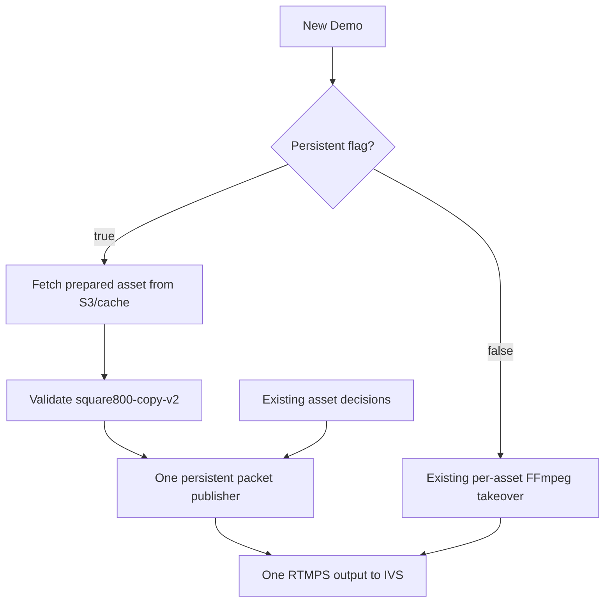

# Persistent Demo publisher (opt-in)

## Selecting the flow

`DEMO_PERSISTENT_PUBLISHER_ENABLED=false` (or unset) keeps the existing FFmpeg takeover flow. Only literal `true` and `false` are accepted. Set `DEMO_PERSISTENT_PUBLISHER_PATH` to the compiled helper when enabling the flag.

The mode is stored in each Demo's SQLite payload at creation. Changing ENV and restarting the coordinator affects new Demos. Recovery uses the saved mode, not current ENV. `DEMO_PERSISTENT_DEFAULT_ASSET_S3_URI` selects the prepared v2 default separately from the legacy `ADAPTIVE_DEFAULT_ASSET_S3_URI`; if omitted it uses the existing default URI, which must then already be v2 for persistent startup. The chosen persistent URI is saved with the Demo for recovery across ENV changes. Keep separate default URIs for safe rollback. Existing records migrate to `legacy` with `sourceVersion = takeoverCount + 1`. Public API response shapes remain unchanged.

Legacy and persistent modes use the same GoLive and Laravel APIs and retain the same session/playback URL across content changes. Persistent asset changes do not increment IVS priority or consume takeover capacity. A genuine process recovery can reconnect, increment priority, and consume a takeover.



## Native build

Requirements: C++17 compiler, pkg-config, FFmpeg development libraries (`libavformat`, `libavcodec`, `libavutil`) and json-c development headers. CMake is preferred; the build script supports a direct compiler fallback. On Debian/Ubuntu the development package names are `build-essential cmake pkg-config libavformat-dev libavcodec-dev libavutil-dev libjson-c-dev`. Install dependencies through the normal deployment process, not from the running service.

Use Node >=22.13, then:

```sh
npm ci
npm run build:all
npm run check
npm test
npm run test:publisher
```

`native/build/flawk-publisher --version` reports protocol and linked library versions; `native/build/dependencies.json` records them. Deploy the binary and its compatible shared libraries with the compiled TypeScript. The helper belongs to the coordinator's systemd control group. It is required only for enabled mode or recovery of a saved persistent Demo. Missing/invalid binaries fail readiness; there is no automatic fallback.

## Asset contract

The preparation worker selects the output from the claimed job's `media_profile`, not the Demo ENV flag. Existing `square800-v1` jobs remain unchanged. Explicit `square800-copy-v2` jobs use the same request/result fields with a new profile value and profile-specific S3 key and marker.

The upstream CMS must accept/produce this new profile value and preparation path before scheduling v2 jobs. This repository does not change the CMS or regenerate/upload existing production assets. The default must also be prepared as v2 before enabling the feature.

V2 uses 800×800, square pixels, 30 FPS, H.264 Main level 3.2, one reference frame, no B-frames, IDR every 60 frames, closed GOPs and AAC-LC stereo 44.1 kHz. Preparation normalizes the output matrix and color configuration to BT.709 so source color metadata cannot produce incompatible H.264 parameter sets. Preparation keeps the existing bitrate targets and adds zero-latency tuning. V2 uses VBR HRD signaling because MP4 does not support x264 CBR HRD; rate targets remain constrained. Legacy x264 arguments are unchanged.

V2 pads the last picture and audio to the next complete two-second GOP. For example, a three-second source becomes a four-second prepared asset. No frames are re-encoded during Demo playback. The helper validates packet timestamps, actual IDR NAL units, reference count, audio origin, complete GOPs and codec configuration. Each selected asset must have identical H.264/AAC decoder configuration to the default. A marker or matching dimensions alone does not establish compatibility.

An incompatible selected asset is rejected while the current source continues. An incompatible default prevents startup. No automatic preparation occurs during a Demo.

## Switching, clocks and acknowledgements

Each actual switch starts incoming video at its first IDR, never in the middle. Same-asset renewal extends the hold window without restarting it. Files loop using the same packet rules. Download/validation occurs while the existing output continues. Source switching waits for the next safe video boundary rather than the end of the file.

The publisher owns continuous frame and audio-sample counters. It reschedules packets onto one live timeline, adjusts container packaging, and never opens an encoder/decoder. AAC priming packets before the MP4's presentation origin are omitted; sample-grid alignment may omit one leading/trailing AAC packet at a splice. Audio boundary rounding is at most one packet (~23 ms), without cumulative clock drift. This is not sample-exact audio splicing.

One private stdin pipe carries start configuration and request-ID-based switch/cancel/stop commands; stdout emits ready, switch_committed, switch_rejected, cancelled, progress, fatal and stopped. Credentials never appear in argv, stored state or logs. stderr is drained, not logged. `--local-test` permits local FLV capture only in integration tests; production requires RTMPS.

Commit is acknowledged only after the incoming video IDR is accepted by the output writer. It is not an IVS/viewer acknowledgement. State/content version and hold deadlines update on that receipt. Cancellation before commitment retains the old source; cancellation racing a write waits for the committed receipt and restoration then follows. Stop interrupts all work. Write/connect operations have a five-second deadline. A switch whose result is unknown after twelve seconds kills the helper rather than continuing with uncertain state.

## Deployment and rollback checklist

1. Deploy code and native binary with the flag false. Preserve existing ENV/credentials.
2. Enable v2 scheduling in the upstream preparation workflow, explicitly prepare and verify default/selected assets, and verify codec-config compatibility.
3. Enable the flag on a canary coordinator and start new Demos. Record at least 20 initial starts and 100 default → A → B → default switches on the Fortinet screen.
4. Verify one helper PID/output connection, stable playback URL, continuous timestamps, correct first pictures, expiry, Stop, recovery, and bounded RSS. Measure initial freezes separately; this feature is not a confirmed fix for them.
5. Roll back by setting false and restarting the coordinator. Saved persistent Demos still require the helper until ended. Do not delete the binary while those sessions remain active.

The local integration suite measures commit latency (<=2.1 seconds after asset readiness for the fixtures), exact incoming first packet identity, A/V continuity, decoder success and RSS over 100 switches. Download time, native validation time for large assets, network stalls and HLS viewer delay are separate. No local check proves real IVS connectivity or physical playback.
