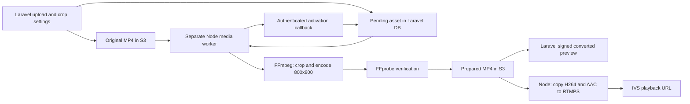

# Node square media processing

`flawk_demo_stream_service` owns Demo media probing, crop/resize, H.264/AAC encoding, output verification, prepared S3 upload, and live FFmpeg publishing. Laravel owns original upload, crop settings, durable preparation records, LLM selection, signed converted preview, and activation of the completed version.



## Durable handoff

`src/media-worker.ts` is a separate process with exactly one conversion at a time and a two-second poll interval. Pending asset rows are the durable queue: uploads remain queued while Node is unavailable. No extra message broker or enqueue HTTP request is required.

All internal Laravel POST routes use the managed `X-Demo-Stream-Secret` and are unavailable until `ADAPTIVE_MEDIA_NODE_ENABLED=true`. They have their own throttle and bypass the inherited mobile API limiter. Responses use `no-store`.

| Route | Purpose |
| --- | --- |
| `/api/internal/demo-media/claim` | Atomically claim the oldest pending/expired asset, issuing a token and 30-minute lease. |
| `/api/internal/demo-media/current` | Check generation/token/lease before upload. |
| `/api/internal/demo-media/complete` | Activate the expected output key for the current generation and token. Idempotent on repeats. |
| `/api/internal/demo-media/fail` | Retry after 10/30 seconds; fail after three attempts. Preserve a ready old version. |

A killed worker recovers through lease expiry (up to 30 minutes). The lease exceeds bounded download, 15-minute conversion timeout, probes, upload and callback calls. Graceful shutdown aborts media subprocesses and reports retry when Laravel is reachable. Old generations/tokens and deleted assets cannot activate. The worker validates bucket allowlists and the exact output prefix; Laravel checks file existence before activation. Node verifies actual codecs/keyframes and the S3 marker; the publisher verifies again before copy mode.

Completion retries never re-encode. An ambiguous completion response never deletes a possibly active output. API outages/cleanup failures can leave unreferenced S3 outputs; review references before cleaning them. Never apply a blanket expiration to the active prepared prefix. SIGKILL can leave temporary job directories; remove abandoned directories only when no worker uses them.

## S3 and profile

Same configured bucket, separate prefixes:

```text
flawk_cms/adaptive_assets/{asset-id}/original/{upload-uuid}.mp4
flawk_cms/adaptive_assets/{asset-id}/prepared/square800-v1/{generation}-{claim-token}.mp4
```

Keep originals for crop edits. Legacy originals retain their keys. Outputs have `media-profile=square800-v1` metadata and no public ACL; keep bucket public-access controls configured. The worker role needs GetObject on allowed originals/defaults, and GetObject/PutObject/DeleteObject on prepared outputs; multipart uploads may also need AbortMultipartUpload. Laravel keeps original upload and preview-signing access. Callback destinations and credentials come from managed configuration, never job payloads.

Profile: 800x800 square pixels, fill-and-crop with the chosen position, no padding, H.264 Main/YUV420P, CFR 30 fps, 3 Mbps CBR target/3 Mb VBV, GOP 60/two seconds; AAC-LC stereo 44.1 kHz/160 kbps. Add silence when absent and pad short audio. MP4 faststart. Normalize orientation and pixel aspect ratio before crop. Verify positive bitrate within the ingest ceiling, frame rates, durations, residual rotation and keyframe spacing. Very short clips may report low startup average bitrate. Source limit: 100 MiB and one hour; corrupt/unsupported media fails asynchronously with Retry in the CMS.

The publisher retains pacing, looping, takeover priority and the same IVS playback URL:

- `copy`: requires S3 marker and verified profile. FFmpeg remuxes existing H.264/AAC into FLV/RTMPS without resizing or encoding.
- `encode`: unmarked legacy inputs are center-cropped to 800x800 by Node at publish time. Backfill to use copy mode. Invalid marked/declared prepared media fails before takeover, retaining the live publisher.

A new prepared URI for the same asset triggers a real switch; ordinary same-asset renewal stays cheap.

## Coordinated deployment

These are rollout instructions; local implementation does not apply production changes.

1. Deploy Laravel's preparation and lease migrations, internal routes, crop/preview UI, and handoff code with `ADAPTIVE_MEDIA_NODE_ENABLED=false`. Rebuild its normal deployment caches. Keep the prior Laravel preparation queue/code for rollback. Drain PHP media work between Demos; stop/restart long-lived media workers before switching ownership so older running code cannot compete with Node.
2. Install FFmpeg/FFprobe with libx264/AAC and AWS CLI on the media host. Build this repo using Node >=22.13: `npm ci`, `npm run check`, `npm test`, `npm run build`. `npm test` loads optional checkout `.env` and `.env.media` files; `.env.media` takes precedence over `.env`, while exported shell variables override both. Set absolute `FFMPEG_PATH` and `FFPROBE_PATH` in `.env.media` when the capable binaries are outside `PATH`. The test reports its selected binaries and fails clearly if configured binaries are unavailable or lack libx264/AAC. It does not load systemd's `/etc/flawk-demo/media.env`; keep the same binary paths in that file for the deployed worker. Configure bounded S3 permissions.
3. Copy `.env.media.example` into `/etc/flawk-demo/media.env`. Set the CMS URL, matching secret, output bucket, source bucket allowlist and work directory. Install `deploy/flawk-media-worker.service` with the actual Node path/user/checkout. Start it; endpoint unavailability while the flag is off is expected. It needs no Go-Live/IVS credentials or publisher SQLite database.
4. Enable Laravel `ADAPTIVE_MEDIA_NODE_ENABLED=true`, keep `ADAPTIVE_IVS_PLAYOUT_ENABLED=false`, rebuild config cache and restart long-lived PHP workers. The enabled flag guards legacy PHP probing/preparation/publishing. Already serialized preparation jobs leave durable rows for Node. Mobile must use `EXPO_PUBLIC_DEMO_STREAM_ENABLED=true`; existing cleanup jobs can still stop legacy sessions.
5. Validate one upload/crop and converted signed preview. Inspect backfill with `php artisan adaptive:prepare-assets --all --include-default --dry-run`, then run the approved backfill without `--dry-run`. Pending/completed assets are skipped; `--retry-failed` includes failures. Raw defaults get inactive records and cannot enter LLM selection. Re-run after completion to print the prepared default URI.
6. Set the same prepared default URI in Laravel and this publisher's `ADAPTIVE_DEFAULT_ASSET_S3_URI`. CMS settings alone do not update EC2. Build/restart `flawk-demo.service` between Demos: systemd runs `dist/src/server.js`. Verify readiness, PID, compiled timestamps and `publishMode=copy` logs.
7. Test the physical 800x800 device with default -> A -> B -> default, stable HLS URL, no player distortion/additional crop, and continuous playback. Check conversion failure, re-crop and worker restart separately.

Worker template limits: one conversion, two encoder threads, `Nice=10`, `CPUQuota=50%`, `MemoryMax=768M`. Tune from measurements. Separate processes still share EC2 resources; use a dedicated media EC2 if preparation affects live streaming.

Rollback: stop Node media processing, wait for/recover the current lease, disable the Laravel flag, rebuild config and restart the prior PHP preparation worker. Both understand the same prepared profile. Do not run both processors concurrently.

`IVS_INGEST_KEYFRAME_INTERVAL_SECONDS=2` remains optional for verified BASIC/STANDARD channels, preserving takeover priority. Leave unset until channel type is confirmed. Preparation reduces live encoding work; S3 fetching, IVS takeover/delivery, and native-player buffering remain.

## Logs

```sh
journalctl -u flawk-media-worker.service -f -o cat
journalctl -u flawk-demo.service -f -o cat
```

| Stage | Measures |
| --- | --- |
| `queue_wait` | Request to worker start; includes retry waits and requires synchronized host clocks. |
| `preparation_job_claim` | Claim API round trip; debug level to avoid idle polling noise. |
| `preparation_s3_download` | S3 size check and local download. |
| `preparation_input_probe` | Source track/dimension/duration inspection. |
| `preparation_ffmpeg_conversion` | Complete offline crop, encoding and faststart. |
| `preparation_output_verify` | Profile and keyframe verification. |
| `preparation_lease_check` | Ownership API round trip before upload. |
| `preparation_s3_upload` | Upload and S3 marker check. |
| `preparation_laravel_activation` | Completion callback and bounded retries. |
| `media_preparation_total` | Whole attempt excluding claim/queue wait; includes nested stages. |

Node logs include assetId, generation, attempt, UTC timestamps and monotonic durationMs. Spans use `demo_timing`; queue wait uses `adaptive_media_timing`, result/failure/cleanup events use `adaptive_media_*`. Laravel logs `adaptive_media_status`. Do not sum total with nested spans. Commands, S3 locations, stderr and credentials are excluded.

Live publishing logs remain separate: `demo_media_ready`/`demo_publisher_start` show mode/profile. Copy uses `ffmpeg_first_published_progress`; encode uses `ffmpeg_first_encoded_frame`. Neither proves that a viewer displayed a frame. CMS preview proves the converted asset; deployed S3/IVS/native hardware and visible first-frame timing require separate observation.

## Local CMS development

Run the media worker separately from the Demo stream server. Copy `.env.media.example` to `.env.media` and set `LARAVEL_API_BASE_URL` to your local CMS API (for example `http://127.0.0.1:8000`), `DEMO_STREAM_SERVICE_SECRET` to the matching CMS secret, and `MEDIA_OUTPUT_BUCKET` to the CMS S3 disk bucket. Loopback HTTP is accepted for local development; remote APIs require HTTPS. Supply the worker AWS credentials through your normal local AWS configuration. Run `npm run media:dev`. This command loads `.env.media`; the stream server continues to use `.env`.

A worker pointed at the hosted CMS cannot claim local database assets. Enabling `ADAPTIVE_MEDIA_NODE_ENABLED` without starting a matching worker leaves uploads pending with zero attempts. The CMS reports this waiting state and enables converted preview after activation.
